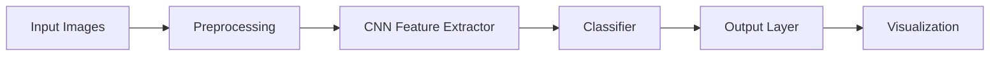
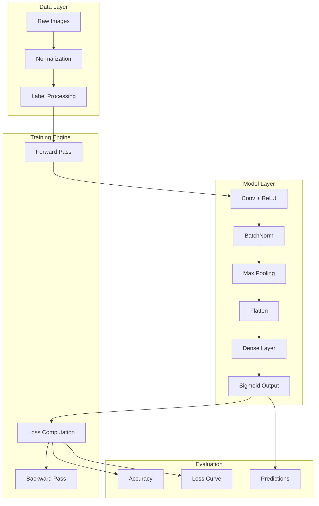

# Happy Model – Smile Detection with Keras

A practical computer vision project that builds a Convolutional Neural Network (CNN) using Keras to detect whether a person is smiling in an image. The project covers the complete deep learning pipeline including dataset preprocessing, model construction, training, inference on custom images, and model visualization.

---

## Overview

This project implements an end-to-end binary image classification pipeline using a CNN built with the Keras Functional API. It is designed for clarity, modularity, and reproducibility, making it ideal for learning core deep learning concepts in computer vision.

---

## Features

- Binary image classification: smiling vs not smiling  
- CNN built using Keras Functional API  
- End-to-end pipeline: preprocessing, training, evaluation, inference  
- Model visualization using `plot_model` and `model_to_dot`  
- Support for custom image prediction  

---

## Dataset

### Facial Smile Dataset

**Description**  
A labeled dataset of facial images annotated as smiling or not smiling.

**Input Shape**  
- 64 × 64 RGB images  

**Output Labels**  
- 0: Not Happy  
- 1: Happy  

**Usage**  
- Loaded using helper functions from `kt_utils.py`  
- Normalized before training  

---

## System Architecture

### High-Level Pipeline

## Modular System Design

## Model Architecture

- **Input Layer**: (64, 64, 3)  
- Convolution + ReLU  
- Batch Normalization  
- Max Pooling  
- Flatten  
- Fully Connected (Dense)  
- **Output Layer**: Sigmoid  

- **Framework**: Keras (TensorFlow backend)  
- **Loss Function**: Binary Cross Entropy  
- **Task**: Binary Classification  

---

## Dataset Preprocessing

- Dataset loaded via `kt_utils.py`  
- Pixel values normalized to range [0, 1]  
- Labels reshaped and transposed  
- Images converted to `float32`  

---

## Training Pipeline

1. Load and preprocess dataset  
2. Build CNN architecture  
3. Compile model with binary cross-entropy loss  
4. Train model on training set  
5. Evaluate on test set  
6. Visualize loss and accuracy  

---

## Inference on Custom Images

1. Place image in the `images/` directory  
2. Resize image to 64 × 64  
3. Load and preprocess image  
4. Run model prediction  
5. Output classification: smiling or not  

---

## Results and Outputs

- Training and test accuracy  
- Binary cross-entropy loss  
- Model summary output  
- CNN architecture plot (`HappyModel.png`)  
- Console predictions for custom images  

---

## Design Principles

- Clear separation of data, model, and inference logic  
- Interpretable CNN architecture  
- Reproducible preprocessing pipeline  
- Educational focus on deep learning fundamentals  

---

## Dependencies

### Requirements

- Python 3.7+  
- TensorFlow / Keras  
- NumPy  
- Matplotlib  
- Pillow  
- pydot  
- graphviz  

---

## Model Visualization

- Architecture plot generated using `plot_model()`  
- SVG visualization using `model_to_dot()`  

---

## License

This project is intended for educational and research purposes.  
Free to use and modify with proper attribution.
